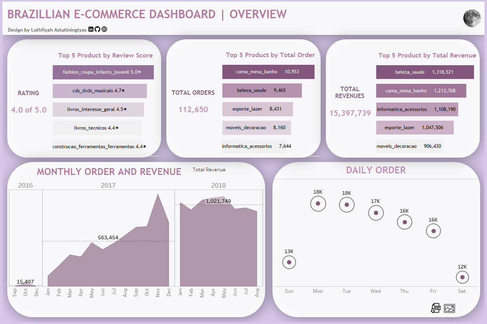

This is my self project. Analyst Brazilian E-Commerce Public Dataset by Olist dataset with SQL using SQL Server. Data source from [kaggle](https://www.kaggle.com/datasets/olistbr/brazilian-ecommerce). 

[Tableau Public](https://public.tableau.com/app/profile/luthfiyah.astutiningtyas/viz/BRAZILLIANE-COMMERCEDASHBOARD/Dashboard1)
